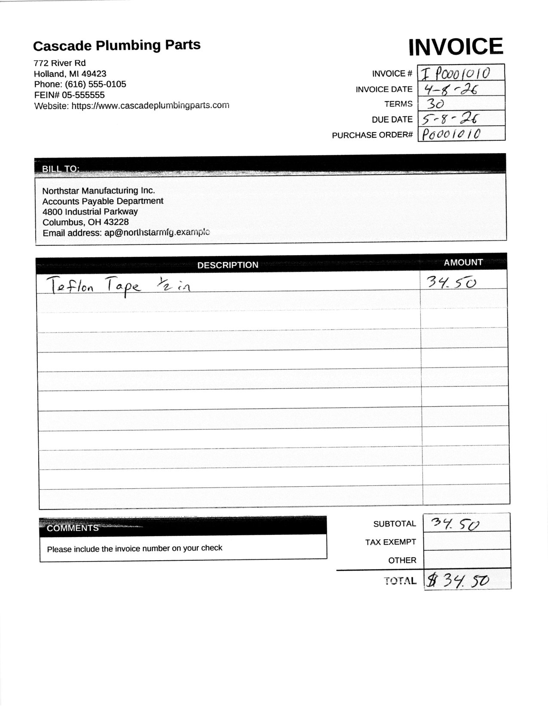

# Accounts Payable Clerk

Responsibilities:
 * Receives electronic invoices; parses invoices into a format consumable by ERP systems.
 * Reviews invoices for exceptions such as missing Purchase Orders; exports invoices on for approval.

## Example

A scanned invoice with handwritten fields, and the extraction result using
Gemma4 12b:

<table align="center">
<tr>
<td><a href="docs/example-invoice.jpg"></a></td>
<td valign="top">
<strong>Vendor:</strong> Cascade Plumbing Parts<br>
<strong>Invoice #:</strong> P0001010<br>
<strong>Invoice date:</strong> 7-8-26<br>
<strong>Due date:</strong> 5-8-26<br>
<strong>Terms:</strong> 30<br>
<strong>Purchase order:</strong> P0001010<br>
<br>
<strong>Line item:</strong><br>
Teflon Tape 1/2 in — $34.50<br>
<br>
<strong>Total:</strong> $34.50
</td>
</tr>
</table>

The vendor fuzzy-matched to master record `V005` (score 100), the purchase
order was found and belongs to that vendor, and the line items sum to the
total — so the invoice is routed `AUTO_APPROVED`.

There were 2 issues with this extraction: the handwritten invoice date is
`4-8-26` but was extracted as `7-8-26`, and the invoice number `I P0001010`
lost its `I` prefix.

```bash
task extract-invoice -- extract tests/fixtures/scanned-invoices/inv-scan-06.pdf
```

The vision model transcribes the page (including the handwritten PO number and
line item), totals are cross-checked, and the vendor and purchase order are
fuzzy-matched against master data. Scanned fixtures pair with
`tests/fixtures/purchase-orders-manual.json`.

<details>
<summary>Full JSON output</summary>

```json
{
  "status": "AUTO_APPROVED",
  "reason": "AUTO_APPROVED",
  "source_file": "tests/fixtures/scanned-invoices/inv-scan-06.pdf",
  "payload": {
    "extraction": {
      "vendor_name_raw": "Cascade Plumbing Parts",
      "vendor_name_variants": [],
      "vendor_address_raw": "772 River Rd\nHolland, MI 49423\nPhone: (616) 555-0105\nFEIN#: 05-555555\nWebsite: https://www.cascadeplumbingparts.com",
      "invoice_number": "P0001010",
      "invoice_date": "7-8-26",
      "due_date": "5-8-26",
      "purchase_order_raw": "P0001010",
      "purchase_order_variants": [],
      "terms": "30",
      "currency": null,
      "line_items": [
        {
          "description": "Teflon Tape 1/2 in",
          "quantity": null,
          "unit_price": null,
          "amount": 34.5
        }
      ],
      "subtotal": 34.5,
      "tax_total": null,
      "total_amount": 34.5,
      "unmapped_fields": [
        {
          "label": "BILL TO",
          "value": "Northstar Manufacturing Inc.\nAccounts Payable Department\n4800 Industrial Parkway\nColumbus, OH 43229\nEmail address: ap@northstarmfg.example.com"
        },
        {
          "label": "COMMENTS",
          "value": "Please include the invoice number on your check"
        },
        {
          "label": "TAX EXEMPT",
          "value": null
        },
        {
          "label": "OTHER",
          "value": null
        }
      ]
    },
    "math_ok": true,
    "line_sum_ok": true,
    "reason_code": "AUTO_APPROVED",
    "vendor_match": {
      "vendor_id": "V005",
      "vendor_name": "Cascade Plumbing Parts",
      "score": 100.0,
      "margin": 43.39622641509434,
      "confident": true,
      "candidates": [
        {
          "id": "V005",
          "name": "Cascade Plumbing Parts",
          "score": 100.0
        },
        {
          "id": "V009",
          "name": "BlueRidge Plumbing Distributors",
          "score": 56.60377358490566
        },
        {
          "id": "V014",
          "name": "FlowMaster Plumbing Wholesale",
          "score": 54.90196078431373
        }
      ]
    },
    "po_match": {
      "purchase_order_id": "P0001010",
      "vendor_id": "V005",
      "score": 100.0,
      "margin": null,
      "confident": true,
      "candidates": [
        {
          "id": "P0001010",
          "name": "P0001010",
          "score": 100.0
        }
      ]
    },
    "page_count": 1
  }
}
```

</details>

Extraction is transcription-only — OCR noise stays as printed (hence the
misreads noted above). Matching, math checks, and routing decide `AUTO_APPROVED` /
`HUMAN_REVIEW` / `REJECTED` downstream, and anything the schema does not cover
lands in `unmapped_fields`.

## Development

[uv](https://docs.astral.sh/uv/) manages dependencies; [Task](https://taskfile.dev) is the interface.

```bash
# install deps + dev tools
task init:dev

# available tasks
task --list

# ruff lint/format check + basedpyright
task lint

# pytest
task test

# lint + tests (run before merging a change-set)
task check
```

## Packages

| Package | Import | Role |
|---------|--------|------|
| `packages/ap-clerk-core` | `ap_clerk` | Domain library |
| `packages/ap-clerk-cli` | `ap_clerk_cli` | Thin CLI frontend |

```bash
cp config.example.toml config.toml
# edit api_key, base_url, model, masters paths

task extract-invoice -- extract path/to/invoice.pdf
# or: uv run --package ap-clerk-cli ap-clerk extract path/to/invoice.pdf
```
